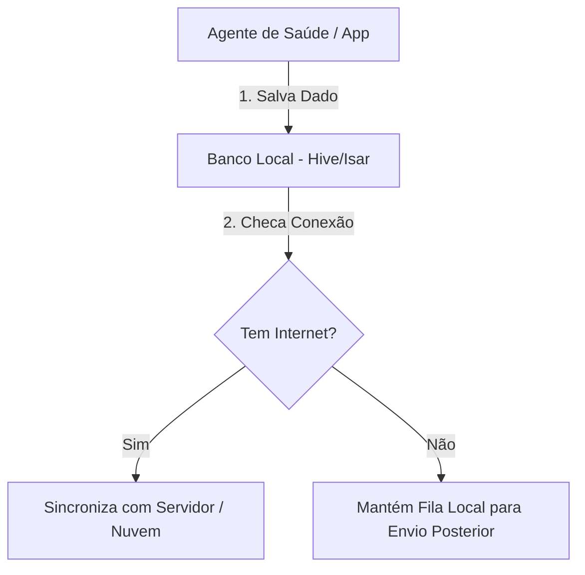

 🏥 Saúde Indígena App (`saude_indigena_app`)

> Aplicação mobile em Flutter voltada à gestão vacinal e apoio à saúde em áreas isoladas, com suporte completo a funcionamento offline e sincronização na nuvem.

---
 📌 Sobre o Projeto

O **Saúde Indígena App** foi desenvolvido para substituir o registro manual em papel utilizado por Agentes Indígenas de Saúde (AIS) e equipes em campo. A ferramenta garante agilidade, segurança no histórico do paciente e assertividade no controle vacinal em regiões com conectividade limitada ou inexistente.

✨ Principais Funcionalidades (v1.0)
- 👤 **Cadastro de Pacientes:** Registro e busca simplificada de moradores das comunidades.
- 💉 **Carteira Vacinal Digital:** Histórico de doses aplicadas e pendentes por paciente.
- 🔐 **Autenticação:** Acesso restrito para agentes de saúde cadastrados.
- 📡 **Suporte Offline:** Coleta de dados em campo sem dependência de internet.

---

🛠️ Tecnologias Utilizadas

- **Linguagem:** Dart
- **Framework:** Flutter
- **Gerenciamento de Estado:** *(Ex: Provider / Bloc / GetX)*
- **Armazenamento Local:** *(Ex: Hive / Sqflite / Isar)*
- **Backend / Sincronização:** *(Ex: Firebase / APIREST)*

---

 🚀 Como Executar o Projeto

 Pré-requisitos
- [Flutter SDK](https://flutter.dev/docs/get-started/install) instalado.
- [Git](https://git-scm.com/) configurado.
- Dispositivo físico ou emulador (Android/iOS).

Passo a passo
1. Clone o repositório:
   ```bash
   git clone [https://github.com/vxwerz/saude_indigena_app.git](https://github.com/vxwerz/saude_indigena_app.git)
### 📐 Arquitetura do Fluxo Offline-First


